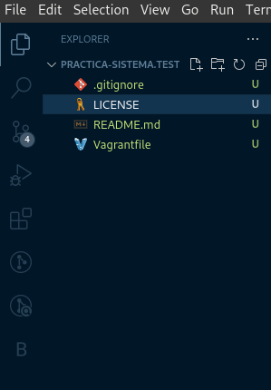
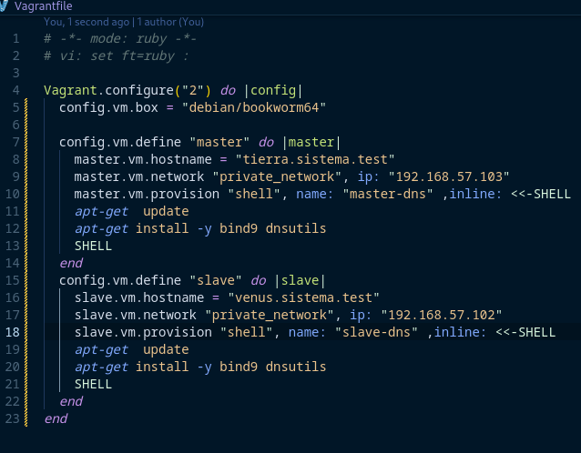
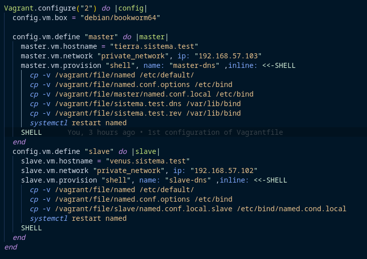
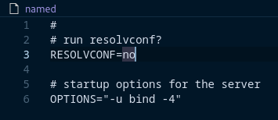
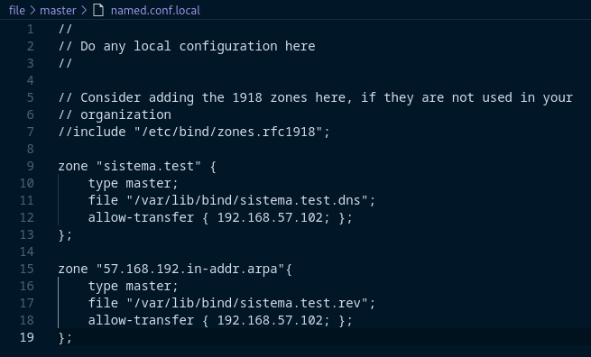
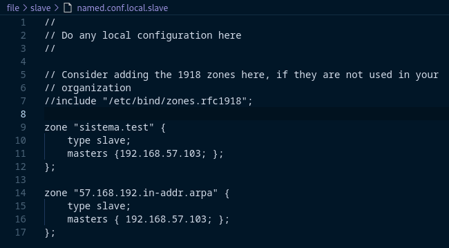
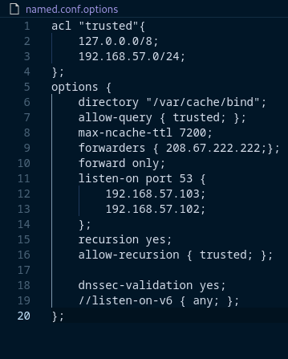
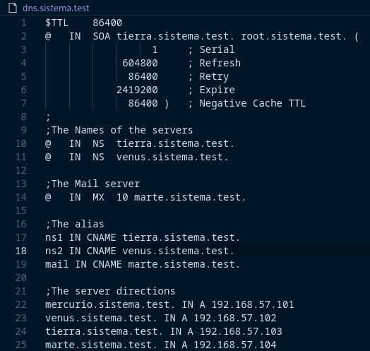
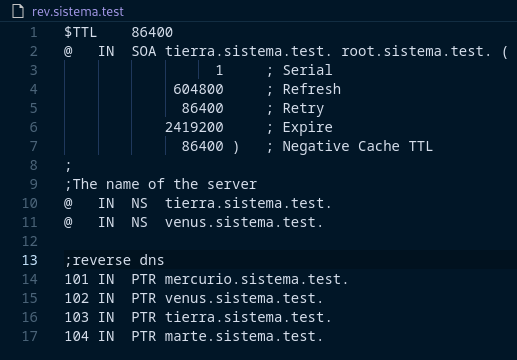

# DNS Configuration for `sistema.test`

This repository contains a practical implementation of a DNS system with master and slave servers, along with forward and reverse zones for the fictitious domain `sistema.test`. The configuration includes zone transfers, DNSSEC validation, recursive queries control, and aliasing. It is designed for educational purposes and demonstrates the setup of a functional DNS infrastructure in a virtualized environment using Vagrant and VirtualBox.

## Table of Contents
1. [Introduction](#introduction)
2. [Prerequisites](#prerequisites)
3. [Network and Equipment Configuration](#network-and-equipment-configuration)
4. [DNS Server Configuration](#dns-server-configuration)
    1. [Master Server Setup](#master-server-setup)
    2. [Slave Server Setup](#slave-server-setup)
    3. [DNSSEC Validation](#dnssec-validation)
    4. [Access Control List (ACL)](#access-control-list-acl)
    5. [Caching and Forwarding](#caching-and-forwarding)
    6. [Alias Configuration](#alias-configuration)
5. [Zone Transfer and Verification](#zone-transfer-and-verification)
6. [Testing and Validation](#testing-and-validation)

## Introduction

This project demonstrates the setup of a DNS system for the domain `sistema.test` within the network `192.168.57.0/24`. It includes the following components:
- A **master DNS server** (`tierra.sistema.test`) that holds the authoritative data for the zone.
- A **slave DNS server** (`venus.sistema.test`) that retrieves zone information via AXFR.
- **Aliases** for key services, including `ns1`, `ns2`, and `mail.sistema.test`.
- DNS **forwarding** to the OpenDNS public server (`208.67.222.222`) for queries outside the local zone.

The practice also incorporates secure DNS transactions with DNSSEC, ensuring that the zone data is validated for integrity and authenticity.

## Prerequisites

Before you begin, ensure that you have the following installed:
- [Vagrant](https://www.vagrantup.com/)
- [VirtualBox](https://www.virtualbox.org/)



## Network and Equipment Configuration


The network is configured to use the IP range `192.168.57.0/24`, and the DNS setup involves several virtual machines. Below is the list of devices:


| **Host**       | **FQDN**                 | **IP Address**      |
|----------------|--------------------------|---------------------|
| Linux GUI      | `mercurio.sistema.test`   | `192.168.57.101`    |
| Debian (Text)  | `venus.sistema.test`      | `192.168.57.102`    |
| Debian (Text)  | `tierra.sistema.test`     | `192.168.57.103`    |
| Windows Server | `marte.sistema.test`      | `192.168.57.104`    |




## DNS Server Configuration


### Master Server Setup

The master DNS server (`tierra.sistema.test`) holds authority over both the direct (`sistema.test`) and reverse (`57.168.192.in-addr.arpa`) zones. The DNS daemon is configured to:
- Listen only on **IPv4** addresses.
- Respond to queries from the local network and specific IP ranges.
- Perform DNSSEC validation.

The `named.conf.local` file contains the zone declarations for `sistema.test` and its reverse zone. The TTL for negative caching has been set to **two hours** (7200 seconds) to control the time-to-live for failed lookups.



### Slave Server Setup

The slave DNS server (`venus.sistema.test`) acts as a backup for the master. It retrieves the zone information from `tierra.sistema.test` using **AXFR** transfers. The configuration also enforces recursive query control and implements DNSSEC validation.




### DNSSEC Validation

The master DNS server is configured to validate DNSSEC queries. This ensures that all DNS responses are authenticated and not tampered with. You can enable this in the `named.conf.options` file by setting the following directive:

```bash
dnssec-validation yes;
```

### Access Control List (ACL)

Both the master and slave DNS servers restrict recursive queries to internal hosts within the following networks:
- **127.0.0.0/8** (loopback)
- **192.168.57.0/24** (local network)

The ACL configuration allows safe DNS querying within the trusted network while preventing unauthorized external access.

### Caching and Forwarding

Any queries for zones that the local DNS server is not authoritative for are forwarded to the **OpenDNS server** (`208.67.222.222`). This ensures that external DNS queries are resolved reliably and quickly.




### Alias Configuration

The following aliases are defined in the zone file:
- `ns1.sistema.test` → `tierra.sistema.test`
- `ns2.sistema.test` → `venus.sistema.test`
- `mail.sistema.test` → `marte.sistema.test`

`marte.sistema.test` is configured as the **MX** (Mail Exchanger) for the `sistema.test` domain.





## Zone Transfer and Verification

To ensure redundancy and fault tolerance, the zone data from the master server is automatically transferred to the slave server using **AXFR**. This allows the slave to respond to queries even if the master is unavailable. Logs and direct checks using tools like `dig` or `nslookup` can be used to verify that the zone transfer is successful.

Example command to verify zone transfer:

```bash
dig AXFR sistema.test @venus.sistema.test
```

## Testing and Validation

You can validate the DNS setup using tools like `dig` and `nslookup` to perform various DNS queries:

- Resolve `A` records for `tierra.sistema.test` and other hosts.
- Test reverse DNS lookups.
- Verify the DNS aliases `ns1.sistema.test` and `ns2.sistema.test`.
- Query for the **NS** records to check the name servers of `tierra.sistema.test` and `venus.sistema.test`.
- Check for the **MX** record for `sistema.test`.

Example command to query for A records:

```bash
dig A tierra.sistema.test
```

Example command to query MX records:

```bash
dig MX sistema.test
```

Logs on both the master and slave servers can also be inspected to ensure proper functionality.


